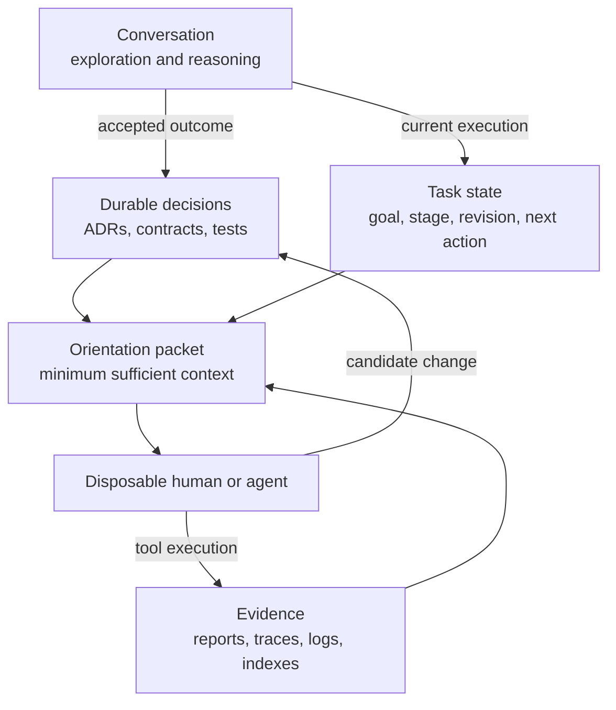
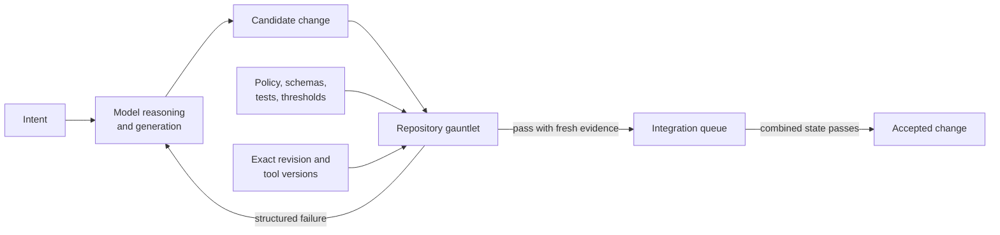
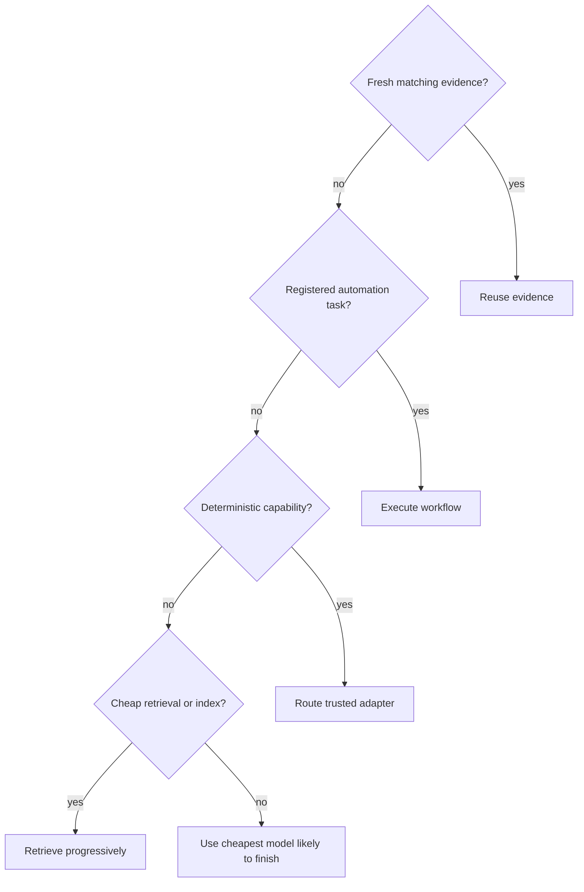
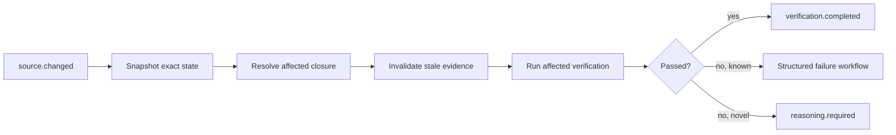
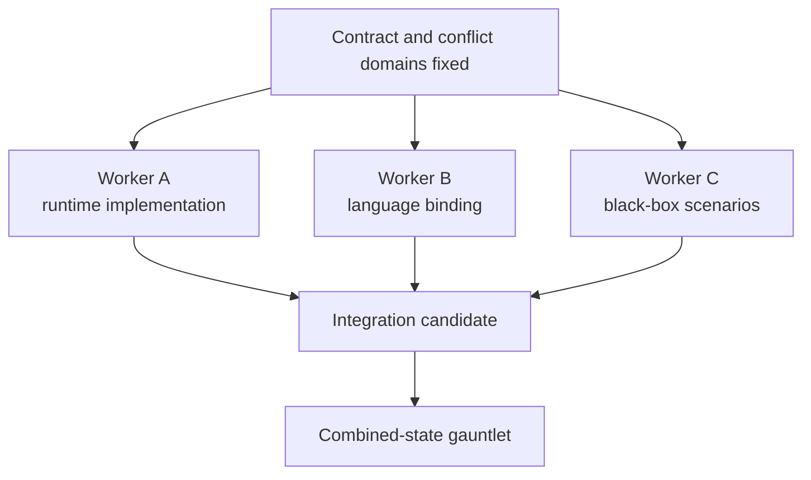

# The Repository Is the Runtime

## How to build software that survives weak models, disposable agents, limited budgets, and its own future

Software teams are beginning to discover an uncomfortable truth about agent-driven development: generating code was never the whole job.

A capable model can produce an impressive implementation quickly. A cheaper model can often do the same when the task is narrow and the prompt is good. Yet neither fact tells us whether the result is correct, maintainable, secure, compatible, or even the change that was requested. It also does not tell the next agent what happened, why it happened, or whether yesterday's test result still applies today.

The durable advantage does not come from making an agent remember more. It comes from designing a repository that requires less memory from every agent that touches it.

This article develops that idea into an operating system for software work:

> **Context is RAM, not disk.**\
> **The agent should not carry the project.**\
> **The project should carry the agent.**\
> **Agents can be disposable.**\
> **The system's understanding cannot be.**\
> **Do not make agents remember more.**\
> **Make them easier to re-orient.**

It is not a framework tied to one language, product, model vendor, or agent host. A human can follow it manually. A single coding agent can use it locally. A multi-agent orchestrator can automate it. The central rule remains the same:

> Generation is probabilistic. Acceptance must not be.

---

## 1. The real optimization target

Teams under budget pressure naturally optimize token counts. That instinct is directionally right and operationally dangerous.

The cheapest call is not necessarily the cheapest outcome. A weak model that consumes ten attempts, repeats repository exploration, reruns unchanged tests, and leaves a human with an unverifiable diff may cost more than a stronger model that completes the task in two attempts. Conversely, assigning a frontier model to file discovery, JSON parsing, formatting, or test execution is pure waste.

The useful unit of economics is:

```text
total model tokens and cost
---------------------------
 verified, accepted tasks
```

Not tokens per call. Not lines generated per minute. Not number of simultaneous agents.

A practical priority order is:

1. correctness;
2. verified changes;
3. minimal unnecessary context;
4. minimal unnecessary model calls;
5. minimal duplicated work;
6. reproducible state; and
7. efficient delegation.

The ordering matters. A saved model call does not justify skipping a security gate. A higher mutation score does not justify missing an integration test. A fast agent does not get to certify itself.

This produces a compact operating principle:

> **Reason with models.**\
> **Compute with tools.**\
> **Search structurally.**\
> **Store state externally.**\
> **Communicate through references.**\
> **Verify deterministically.**\
> **Retrieve progressively.**\
> **Delegate narrowly.**\
> **Automate repetition.**\
> **Measure everything.**

"Measure everything" means observable work, cost, evidence, and outcomes. It does not mean collecting private reasoning, secrets, or user content.

---

## 2. Why the giant instruction file fails

The first response to unreliable agent output is usually more steering:

- tell it to write clean code;
- tell it to use tests;
- tell it not to leak secrets;
- tell it to avoid internal imports;
- tell it to update documentation;
- tell it to think about cancellation;
- tell it to keep functions simple;
- tell it to remember everything that went wrong last time.

Eventually the repository acquires a ten-page instruction file that every agent must load. This feels like governance. It is often governance theater.

Long instructions compete with the task, source code, tool output, and conversation for finite attention. Rules soften. Important constraints disappear into the middle. The same agent that can quote a rule can still violate it in the next edit.

The remedy is not zero instruction. It is a separation of concerns:

| Concern                  | Best durable form                             |
| ------------------------ | --------------------------------------------- |
| A few universal values   | Small root constitution                       |
| Domain language          | Glossary and domain documents                 |
| Durable trade-offs       | ADRs and decision register                    |
| Public behavior          | Schemas, types, contracts, examples           |
| Current task             | Small task packet with acceptance criteria    |
| Current repository state | Generated orientation packet                  |
| Mechanical policy        | Compiler, linter, structural rule, test, gate |
| Large output             | Referenced report or log                      |
| Historical execution     | Revision-bound evidence                       |

Instructions state values. Executable checks enforce mechanically decidable rules.

If internal package imports are forbidden, test an ast-grep rule. If a JSON envelope must reject unknown fields, encode it in a strict schema. If public TypeScript exports must not drift, commit an API report. If a process boundary must be supervised, add a data-flow query and fault-injection tests. Do not ask every future agent to rediscover these obligations from prose.

The best agent instruction is often an exit code.

---

## 3. The four layers of repository memory

"Store state on disk" does not mean dumping every conversation into Markdown. A transcript preserves chronology but mixes decisions, abandoned branches, repeated questions, speculation, and implementation details. It is an archive, not an operational memory.

A durable repository separates four kinds of memory.

### 3.1 Stable understanding

This is the slow-changing truth of the system:

- source code;
- schemas and public types;
- tests and fixtures;
- domain terminology;
- architectural decisions;
- security boundaries;
- compatibility promises;
- release and quality policy.

Stable understanding belongs in version control. It is reviewed like code because it governs code.

### 3.2 Mutable task state

This answers what is happening now:

- work-item ID;
- bounded objective;
- acceptance criteria;
- current stage;
- base and candidate revisions;
- lease owner;
- last verification;
- known blocker;
- next action.

Task state should be small, machine-readable, and scoped per work item. A single global state file becomes a race condition as soon as parallel work begins.

### 3.3 Derived indexes and evidence

This is expensive knowledge that can be reproduced:

- dependency and symbol graphs;
- LSP references;
- CodeQL databases and findings;
- coverage and mutation reports;
- test logs;
- benchmark samples;
- tool traces;
- generated orientation packets.

These artifacts may be local, content-addressed, cached, or retained by CI. They should carry input and revision identity. They are not necessarily source-controlled.

### 3.4 Ephemeral conversation

Conversation is useful for exploration, negotiation, and semantic reasoning. It is not authoritative project state.

Important outcomes graduate from conversation into one of the first three layers. Everything else is allowed to disappear.



The crucial asymmetry is that the agent may disappear at any time. The repository must still be able to reconstruct the next useful move.

---

## 4. Treat orientation like compilation

Many teams solve onboarding with a README and solve agent handoff with a summary. Both decay because they are hand-authored snapshots of moving state.

A better orientation command behaves like a compiler:

```text
repository snapshot
    -> parse and index
    -> resolve task and revision
    -> analyze affected relationships
    -> reuse fresh evidence
    -> reduce and rank
    -> validate completeness
    -> emit a bounded orientation packet
```

The repository is the source language. A context graph is the intermediate representation. The prompt-sized orientation packet is compiled output.

The command should work in a dirty checkout. It should report, not assume:

- repository root and exact revision;
- staged, unstaged, and untracked deltas;
- active work item and acceptance state;
- recent commits;
- affected public surfaces;
- last valid verification;
- missing or stale evidence;
- capability availability;
- references for deeper inspection.

It should not print the entire codebase, every historical decision, or megabytes of successful logs.

### Progressive disclosure

An effective packet has three layers:

1. mandatory constraints, failures, and stale evidence;
2. directly relevant working context; and
3. references for deterministic expansion.

This gives a new agent a fast path:

```text
run orientation command
  -> read objective and current delta
  -> inspect referenced contract/test neighborhood
  -> verify evidence freshness
  -> continue from next action
```

The model does not reconstruct the project from conversation history. It compiles the current project into the context it needs now.

---

## 5. The authority split: models propose, repositories decide

Agent-driven development fails when generation and authority are conflated.

A model may be good at:

- interpreting ambiguous intent;
- proposing architecture;
- generating routine code;
- explaining unfamiliar systems;
- hypothesizing about a failure;
- designing adversarial scenarios;
- reviewing trade-offs.

A model should not be the authority for:

- whether formatting passed;
- whether a schema is valid;
- whether types compile;
- whether tests passed;
- whether coverage regressed;
- whether a mutant survived;
- whether a secret was detected;
- whether evidence belongs to the current revision;
- whether a protected branch may accept the change.

Those questions have deterministic or policy-driven answers.



The model is a change producer. Producer identity grants no trust. A human author, a cheap model, and a frontier model all submit candidates to the same boundary.

This is the mechanism that makes cheaper models viable.

---

## 6. Can a medium model sit in the driver's seat?

Yes—with one important correction: the driving seat should control execution, not truth.

A medium model can safely orchestrate a repository when:

- work arrives as bounded vertical slices;
- public contracts and conflict domains are explicit;
- the orientation packet is current and small;
- mechanical work routes to tools;
- tests and policies cannot be weakened by the driver;
- failures are normalized rather than dumped as unbounded logs;
- repeated failures trigger escalation;
- architecture changes require stronger or human review;
- integration authority remains outside the model.

Under those conditions, the medium model becomes a semantic scheduler. It chooses the next meaningful action, delegates narrow generation, interprets novel failures, and communicates decisions. It does not manually perform every search, test, retry, or merge decision.

### What will go wrong without those conditions?

A medium model is more likely to:

- accept a locally plausible design that violates a distant invariant;
- rationalize a failing test as obsolete;
- edit the gate instead of fixing the behavior;
- overfit examples while missing state-space failures;
- duplicate exploration already performed by another agent;
- lose architectural intent in a long context;
- continue a repeated repair loop after its hypothesis has failed;
- produce confident but incomplete completion reports.

The answer is not to replace it with a stronger model for every action. The answer is to make these failures difficult to authorize.

### A cost-aware model escalation policy

| Work                                       | Default mechanism                               |
| ------------------------------------------ | ----------------------------------------------- |
| File operations, search, parsing, counting | Deterministic tool                              |
| Known workflow                             | Registered automation task                      |
| Relevant context discovery                 | Index, Git, LSP, structural query               |
| Routine bounded implementation             | Cheapest capable coding model                   |
| Focused review or test generation          | Cheap or medium model with a narrow packet      |
| Repeated novel failure                     | Strong reasoning model                          |
| Public architecture or security boundary   | Strong model plus human judgment where material |
| Acceptance and merge eligibility           | Deterministic verifier and repository policy    |

The system should start cheap, measure failure, and escalate deliberately. It should not remain loyal to a weak model after repeated failures make the total workflow more expensive.

> A medium model can drive the car. It should not be allowed to move the guardrails, rewrite the traffic laws, or declare that the destination was reached.

---

## 7. Disposable agents and continuous work

Agent replacement is not primarily a summarization problem. It is a state-reconstruction problem.

A replacement agent needs five things:

1. the exact candidate and base revisions;
2. the bounded work item and acceptance criteria;
3. the current delta and affected contracts;
4. fresh evidence plus invalidation state;
5. the next unresolved action.

If those exist on disk, the identity of the previous agent is largely irrelevant.

### The handoff contract

Workers should return results, not autobiographies:

```json
{
  "status": "done",
  "workItem": "T-17",
  "stage": "hardener",
  "baseRevision": "def456",
  "candidateRevision": "83d21af",
  "evidence": {
    "tests": ".agent/reports/T-17/tests.json",
    "mutation": ".agent/reports/T-17/mutation.json"
  },
  "findings": [],
  "risks": [],
  "nextAction": "source-blind-qa"
}
```

Source code already in the working tree should not be copied into the response. Logs already on disk should be referenced. The orchestrator can inspect more only when the compact result indicates that it matters.

### Evidence must be revision-bound

"Tests passed" is meaningless without knowing what was tested.

Useful evidence binds:

- candidate revision or exact tree digest;
- relevant inputs and dependency closure;
- tool and configuration versions;
- environment where material;
- exit status and structured findings;
- raw artifact reference and digest;
- validity and invalidation rules.

A new commit may invalidate some evidence and leave other evidence reusable. A deterministic controller should decide that closure. The next agent should not rerun everything from superstition.

### Continuity test

A repository is genuinely agent-resilient if a fresh medium model can:

1. run one orientation command;
2. identify the current task and candidate;
3. find the relevant contracts and tests without broad exploration;
4. distinguish passed, failed, missing, and stale evidence;
5. continue useful work without reading the prior conversation.

If that fails, the project still lives inside its agents.

---

## 8. Roles are evidence boundaries, not agent costumes

A useful change gauntlet separates responsibilities:

```text
small work item
  -> specifier
  -> implementer
  -> cleaner
  -> hardener
  -> source-blind QA
  -> deterministic verifier
  -> integration queue
```

These are not necessarily seven agents. Spawning a role for ceremony wastes context and money. One worker may perform several roles on a small change as long as the evidence boundaries remain distinct.

### Specifier

Turns intent into observable acceptance criteria, failure cases, and a black-box procedure. It avoids a giant file-by-file implementation fantasy.

### Implementer

Produces the smallest working vertical change and focused tests. It proposes; it does not approve.

### Cleaner

Attacks structure:

- complexity and CRAP;
- duplication;
- naming and cohesion;
- dependency direction;
- public API growth;
- dead code and dependencies;
- suppressions and unnecessary abstraction.

### Hardener

Assumes the implementer tested only what it imagined. It attacks:

- surviving mutants;
- generated and model-based state sequences;
- malformed input;
- boundaries and Unicode;
- cancellation and timeouts;
- concurrency and process faults;
- resource limits;
- security and data flow;
- cross-language disagreement;
- performance budgets.

### Source-blind QA

Uses public surfaces like a real person. It does not read implementation rationale. A useful QA finding becomes a deterministic replay, fixture, assertion, or explicitly adjudicated requirement.

### Final verifier

Reasons about nothing and edits nothing. It checks evidence origin, freshness, completeness, and policy.

The key lesson from disciplined human workflows is to adopt the values, not blindly impose the choreography. Humans may benefit from strict red-green-refactor sequencing. An agent may naturally implement a small unit and then add the test. If both paths yield the same independently verified values, forcing one private sequence may add cost without adding quality.

---

## 9. Quality is a vector, not a score

Line coverage answers whether code executed. It does not answer whether tests would notice the wrong behavior.

Mutation testing changes operators, conditions, literals, and control flow, then checks whether tests fail. Surviving mutants reveal assertions that are absent, weak, or unable to observe the changed behavior. Yet mutation alone still does not prove requirements, concurrency, compatibility, or security.

CRAP combines complexity and coverage to identify functions that are both hard to reason about and weakly exercised. It is a structural risk signal, not a definition of clean code.

Property-based testing generates broad input spaces, shrinks failures, and preserves replay seeds. State-model testing explores sequences against a simpler model. Fuzzing searches malformed and adversarial boundaries. Differential fixtures expose disagreement between languages or implementations.

These tools answer orthogonal questions:

| Evidence class         | Question                                                         |
| ---------------------- | ---------------------------------------------------------------- |
| Structure              | Is the code becoming difficult to change safely?                 |
| Coverage               | Which code paths executed?                                       |
| Mutation               | Would tests detect plausible implementation faults?              |
| Property/state testing | Do invariants survive generated values and sequences?            |
| Differential testing   | Do implementations agree on shared cases?                        |
| API/schema checks      | Did a public contract drift?                                     |
| Runtime adversity      | What happens under cancellation, races, crashes, and exhaustion? |
| Security/data flow     | Can untrusted or sensitive data cross a forbidden boundary?      |
| Performance/resources  | Did latency, memory, or bundle cost regress?                     |
| Source-blind QA        | Does the product behave correctly through public surfaces?       |
| Evidence integrity     | Do these results actually belong to this candidate?              |

No category compensates for another.

### What the hardener often teaches

A mutation run does more than demand extra tests. It can reveal redundant code. If two guards always lead to the same public outcome, no test can distinguish them. The correct response may be deletion, not a contrived assertion or a hidden exclusion.

Equivalent mutants do exist. Classify them narrowly with a reason. Never hide them behind a broad file exclusion. Track score floors and survivor ceilings per critical target so a healthy aggregate cannot conceal one weak subsystem.

---

## 10. A tool-aware execution layer

Giving an agent Bash is not the same as building a tool-aware system.

A mature harness exposes semantic capabilities rather than a giant list of executable names:

```yaml
structural_search:
  providers:
    - adapter: ast-grep
      cost: low
      effects: [filesystem-read]
      output: structured-findings

symbol_references:
  providers:
    - adapter: language-server
      cost: low
      effects: [filesystem-read]

secret_detection:
  providers:
    - adapter: gitleaks
      cost: low
      gate: candidate
```

The model asks, "find calls shaped like this," not, "remember the flags for a structural search utility." The router resolves applicability, platform, version, permissions, output normalization, and fallback.

### A practical routing hierarchy



Examples:

| Need                           | Prefer                                            |
| ------------------------------ | ------------------------------------------------- |
| Literal or regex search        | `rg`                                              |
| File discovery                 | `fd` or `find`                                    |
| Syntax relationship            | ast-grep                                          |
| Definition or references       | pinned LSP                                        |
| Cross-function data flow       | CodeQL                                            |
| JSON/YAML transformation       | `jq` or `yq`                                      |
| Types and compilation          | compiler                                          |
| Dead exports/dependencies      | Knip or equivalent                                |
| Secrets                        | Gitleaks                                          |
| Mutation sensitivity           | Stryker, PIT, or language equivalent              |
| Generated invariants           | fast-check, QuickCheck, Hypothesis, or equivalent |
| Statistical command comparison | Hyperfine                                         |
| Filesystem-triggered feedback  | Watchexec or native watcher                       |

LSP and CodeQL deserve distinct roles. LSP cheaply retrieves the symbol neighborhood: definitions, references, document symbols, and diagnostics. CodeQL constructs deeper semantic and data-flow relationships across functions and packages. Neither replaces the compiler, and neither should flood every task context.

---

## 11. Keep raw output out of model context

Test runners, build tools, Git diffs, and scanners can emit megabytes. Most successful output is operational evidence, not useful reasoning context.

A tool trace should record:

- task and provider identity;
- exact revision;
- duration and exit code;
- raw and model-visible bytes;
- redaction count where applicable;
- failure fingerprint;
- raw log reference and digest;
- estimated context reduction.

The model usually needs:

```text
PASS unit tests
duration: 8.4s
evidence: .agent/logs/tool-...log
```

On failure it needs a bounded normalized summary plus a reference for expansion.

In one real full verification run, 21 gates produced roughly 57 KB of raw output but exposed about 3.8 KB to the model. Using a transparent byte-based estimate, that avoided roughly 13,500 context tokens and reduced visible output by 94.9%. This is not billing-exact token accounting, but it is sufficient to identify orders of magnitude and compare trends.

The larger lesson is not the number. It is the architecture: preserve evidence, not noise.

---

## 12. Make agents interrupt-driven

Polling is a wasteful habit inherited from conversational agents:

```text
check status
check tests
check worker
check repository
check again
```

Known repository events can trigger deterministic workflows without waking a model:



Filesystem notifications are hints, not truth. Events may coalesce or arrive late. A fresh repository snapshot remains authoritative.

Every event needs task and revision identity, idempotency, sequencing, budgets, cancellation, and supersession. Otherwise a watcher can publish a green result for code that no longer exists.

### The harness is a resource-owning runtime

An event-driven controller is not complete merely because it no longer polls. It owns subprocesses, timers, filesystem watchers, stream readers, temporary directories, listener registrations, and observer subscriptions. Those resources must have the same explicit lifecycle as the task they serve.

A robust task lifetime composes three termination sources:

```text
caller cancellation
      + deadline
      + newer revision supersedes this task
                 |
                 v
       one owned cancellation signal
                 |
                 v
      tool and worker execution
                 |
                 v
 exactly one terminal task outcome
```

The first accepted terminal cause wins. Late process output cannot turn a cancelled task green. Cleanup happens on success, failure, cancellation, and early return. Disposal is idempotent and releases resources in dependency-safe reverse order. Garbage collection and process exit are not cleanup strategies.

Event consumers need isolation too. Use bounded queues or asynchronous iterators with explicit completion. When a consumer lags, discard replaceable progress before detaching it from critical delivery. A dashboard, logger, or optional observer must never hold the verifier open or change its verdict.

Failures still cross seams as structured data. Internally, preserve exception causes and aggregate failures in bounded debug evidence so diagnosis retains causality. Ambient execution context may carry task, revision, trace, worker, and tool identifiers; it must not become hidden storage for source content, secrets, authorization, or acceptance state.

Lazy loading belongs after routing and authorization. Discovering an adapter should read metadata, not execute its implementation. Load only the selected local implementation, validate that it matches the registered identity, and keep network installation outside task execution.

---

## 13. Every repeated agent action is a candidate for compilation

Suppose traces repeatedly show:

```text
run targeted test
  -> parse failure
  -> locate affected symbol
  -> rerun targeted test
```

After enough independent occurrences, this may belong in one tested command.

That is the automation promotion loop:

```text
observed repetition
  -> candidate
  -> specified contract
  -> implemented
  -> cleaned
  -> hardened
  -> source-blind exercised
  -> verified
  -> registered
  -> measured
  -> retained, revised, or retired
```

The automation miner should analyze tool traces, not private reasoning. It can group normalized commands, repeated sequences, output reducers, duplicate reads, failure fingerprints, and avoidable model wakeups.

Repetition is only evidence of opportunity. It may indicate:

- a workflow worth scripting;
- a missing tool capability;
- poor task decomposition;
- a flaky test;
- a broken abstraction;
- an agent repeatedly making the same mistake.

Generated automation must never install or activate itself. It enters the same gauntlet as production code.

This is what a self-evolving repository should mean: it observes its work, proposes deterministic improvements, verifies them, measures their economics, and retires them when they no longer pay. It does not autonomously accumulate scripts.

---

## 14. Parallel agents without duplicated chaos

Parallelism helps only when work is genuinely independent.

Do not use subagents to:

- list files;
- search strings;
- parse JSON;
- run formatters;
- execute tests;
- inspect exit codes;
- compare hashes;
- count occurrences.

Those are tool operations.

Parallelize semantic work when tasks have separate dependency and conflict domains. Establish shared schemas and public contracts first, then fan out implementations.



Each work item needs:

- an isolated branch or worktree;
- an exact base revision;
- a task and stage lease;
- minimal stage-specific context;
- an independent candidate gauntlet;
- a merge queue that tests combined state.

Git conflicts detect overlapping text. They do not detect two cleanly merged changes that disagree about protocol semantics. Shared conformance fixtures and integration gates are the semantic conflict detector.

Avoid deep delegation trees. Every layer adds startup time, duplicated context, communication loss, and unclear authority.

---

## 15. "Everything is a plugin"—with an important boundary

Plugin-first architecture is powerful for product behavior. It enables providers, transformations, guards, memory, rendering, observation, and host integration to evolve without kernel changes.

But applying the same philosophy indiscriminately to repository tooling can waste enormous time.

The runtime and the development harness have different jobs:

| Runtime extension system               | Development control plane                     |
| -------------------------------------- | --------------------------------------------- |
| User-extensible behavior               | Maintainer-controlled verification            |
| Stable public plugin contracts         | Replaceable internal tool adapters            |
| Activation and composition semantics   | Direct scripts and pinned executables         |
| Failure policy belongs to product/host | Gate policy belongs to repository             |
| Must not grant implicit authority      | Must remain independent of runtime under test |

The harness may have replaceable adapters, but it does not need to become a general plugin platform. A direct script is often the best abstraction. Do not build extensibility before repeated evidence demonstrates a second implementation or real replacement pressure.

Extensibility is not free. Every extension point creates identity, lifecycle, compatibility, error, security, documentation, and testing obligations.

---

## 16. Failures must become data

Agents cannot reliably govern workflows by scraping arbitrary stderr and stack traces.

Normalize ordinary outcomes:

```json
{
  "status": "failed",
  "check": "mutation",
  "code": "quality.target_below_threshold",
  "target": "src/state-machine.ts",
  "expected": 90,
  "actual": 86.8,
  "evidence": ".agent/reports/mutation.json"
}
```

Rich debug detail still matters. Keep exception messages, stacks, subprocess stderr, and raw payloads in access-controlled debug records. Return safe diagnostics across process, language, and agent boundaries.

This separation improves:

- portability;
- automated routing;
- redaction;
- retry decisions;
- dashboarding;
- human comprehension;
- protection against accidental leakage.

Repeated failures should be fingerprinted from stable fields such as check ID, diagnostic code, location or symbol, stack shape, and relevant input digest.

```text
failure A
failure A
failure A
```

is not a request for a fourth identical retry. It is a request to stop, revisit assumptions, expand context, or escalate reasoning.

---

## 17. Evidence should authorize completion

A polished final message is not proof.

Completion requires:

- the requested behavior exists;
- required gates passed against the exact candidate;
- failures and exclusions were dispositioned;
- public contracts and durable documents agree;
- remaining risks are explicit;
- the candidate is committed or otherwise identified reproducibly;
- the working state is known.

A compact completion report is enough:

```text
Completed T-17 — revision-aware transformation state

Changed:
- public patch schema
- atomic state engine
- cross-language fixtures

Verified:
- candidate profile passed
- mutation 92.8% on new engine
- package branch coverage 98.0%
- zero CRAP violations

Commit:
83d21af

Risks:
- secondary implementation validates scalar coordinates;
  canonical runtime still owns grapheme enforcement
```

The details live behind references. The report improves decision-making without replaying the whole task.

---

## 18. What did not work—or does not scale

An honest architecture includes its rejected instincts.

### More prompt as the default fix

Why it fails: context dilution, repeated tokens, weak enforcement, and rules that cannot prove compliance.

Use instead: a tiny constitution, conditional retrieval, and executable checks.

### One giant global agent state

Why it fails: parallel agents overwrite one another, unrelated tasks contaminate orientation, and stale state appears current.

Use instead: task-scoped state with exact revisions and leases.

### Roles as mandatory agent choreography

Why it fails: startup overhead, duplicated exploration, context copying, and ceremony without independent evidence.

Use instead: mandatory responsibilities with adaptive worker count.

### Maximum parallelism

Why it fails: semantic conflicts, repeated work, integration cost, and communication overhead.

Use instead: parallelize independent ready work after contracts stabilize.

### Model polling deterministic state

Why it fails: wasted calls and race-prone interpretation.

Use instead: events and deterministic controllers.

### Rerun everything after every edit

Why it fails: slow feedback and unnecessary compute.

Use instead: affected candidate checks during iteration, invalidated integration closures next, and deliberate whole-system release profiles.

### Optimize one quality number

Why it fails: metrics become gameable and blind spots remain invisible.

Use instead: orthogonal evidence with non-compensating required gates.

### Self-installing automation

Why it fails: accidental authority growth and fossilized bad workflows.

Use instead: read-only mining and reviewed promotion.

### Store every log forever

Why it fails: disk exhaustion, privacy risk, retrieval noise, and unbounded maintenance.

Use instead: retention, redaction, content addressing, references, and garbage collection.

---

## 19. A minimum viable agent-native repository

Do not begin by installing a hundred tools or building a distributed orchestrator. Start with the smallest useful control loop.

```text
AGENTS.md
docs/
  decisions.md
  adr/
  development/agent-operating-model.md
scripts/
  agent-context
  verify-candidate
  tool-trace
.agent/
  work/<task>/state.json
  logs/
  reports/
spec/
  work-item.schema.json
  tool-trace.schema.json
```

### Stage 1: establish authority

- Define a small root constitution.
- Create one deterministic candidate verification command.
- Make completion depend on its exit status.
- Record exact revision and task identity.

### Stage 2: externalize orientation

- Add a task-scoped state file.
- Add an orientation command that works on dirty state.
- Prefer deltas and references over copied source.

### Stage 3: route tools semantically

- Register a small capability set.
- Normalize tool output.
- Store raw logs outside model context.
- Measure bytes, runtime, failures, and evidence reuse.

### Stage 4: harden quality

- Add mutation and CRAP where supported.
- Add property/state tests for invariant-heavy code.
- Add API/schema drift and cross-language fixtures.
- Add fault, race, security, and source-blind scenarios by risk.

### Stage 5: automate repetition

- Mine traces read-only.
- Review repeated sequences across independent tasks.
- Promote only stable, economical candidates.
- Measure reuse and retire low-value automation.

### Stage 6: add controlled parallelism

- Isolate worktrees and leases.
- Define conflict domains.
- Use revision-bound evidence.
- Revalidate combined state through an integration queue.

At each stage, the repository should remain useful if no agent orchestration exists. Humans should be able to invoke the same tasks and interpret the same evidence.

---

## 20. The dashboard humans actually need

Humans should not have to inspect raw traces or read source code to understand whether the harness works.

A useful local dashboard answers:

- Did the latest candidate and full profiles pass?
- Which capabilities are active, unobserved, or CI-only?
- What tool and task consumed the most time?
- How much raw output was reduced before model exposure?
- Which mutation target is weakest?
- Which coverage class is below policy?
- Are CRAP violations increasing?
- Which repeated sequences are automation candidates?
- How many model calls or agent wakeups were avoided?
- Which evidence is stale or missing?

"Unobserved" must be explained in human language: the harness has not recorded an execution for that capability. It does not automatically mean the executable is absent or the feature is broken.

Dashboards also need measurement boundaries. If only routed commands are observed, say so. Do not pretend interactive shell work, editor actions, or model reasoning are captured. Estimates must be labeled as estimates.

The dashboard is not the authority. It is a projection of authoritative evidence.

---

## 21. Security, permissions, and observability boundaries

Agent-friendly systems can easily become surveillance systems or credential hazards.

Reasonable defaults are:

- local and stateless by default;
- content capture disabled unless explicitly authorized;
- secrets stored as references, never config literals;
- raw logs separated from safe diagnostics;
- tool effects and permissions declared;
- native processes supervised but not falsely advertised as sandboxed;
- optional observers unable to alter the result;
- retention and garbage collection defined before logs grow without bound;
- no silent network access during initialization, inspection, or first run.

The host environment may own enforcement. The repository does not need to invent a universal RBAC system. It does need to describe effects honestly and make policy enforceable where the host supports it.

---

## 22. Planning without plan worship

Agents are excellent at writing beautiful plans. Beauty is not predictive accuracy.

Heavy upfront specifications tend to decay as implementation reveals unknowns. Zero planning wastes the gauntlet on the wrong work. The balance is:

- stabilize domain language and durable architecture boundaries;
- define a small vertical work item;
- state observable acceptance and failure cases;
- implement and verify;
- update durable understanding at the phase boundary;
- repeat.

Plans may be ephemeral. Accepted decisions, public contracts, and evidence are durable.

This resembles agile development for a world where the cost of generation has fallen but the cost of choosing the wrong system has not.

---

## 23. The deeper pros and cons

### Advantages

- Cheaper models become useful for more work.
- Replacing agents becomes routine rather than catastrophic.
- Human and model contributors follow the same acceptance path.
- Context size and duplicated exploration fall.
- Quality rules survive model and host changes.
- Parallel work becomes reproducible.
- Failures become easier to route and debug.
- Repeated work can evolve into deterministic infrastructure.
- Operational claims become inspectable rather than conversational.

### Costs

- The initial repository control plane takes real engineering effort.
- Evidence schemas and invalidation are hard to design correctly.
- Mutation, CodeQL, race, and full conformance profiles can be expensive.
- Too many gates can erase the productivity advantage.
- Tool adapters require upgrades and cross-platform care.
- Metrics can be gamed or misinterpreted.
- Logs create retention, privacy, and disk-pressure obligations.
- Strict contracts slow uncontrolled experimentation.
- A medium model can still make strategic mistakes between the guardrails.

### The governing trade-off

Add a deterministic check when it reliably prevents meaningful rework or risk. Keep it affected and lazy when possible. Run whole-system checks when their purpose requires whole-system evidence. Remove checks or automation whose measured maintenance cost exceeds their protection.

Quality should be uncompromising about required outcomes and economical about how often evidence is recomputed.

---

## 24. A practical answer to the two hardest questions

### Will quality survive a medium model in charge?

It can—if "in charge" means orchestrating bounded semantic work inside a repository-controlled system.

It will not—if the model can weaken tests, reinterpret failures, redesign public contracts casually, approve its own exceptions, or declare completion from memory.

The most economical arrangement is usually:

- deterministic tools for mechanical work;
- the cheapest capable model for narrow generation;
- a medium model for routine orchestration and integration reasoning;
- a strong model or human for novel architecture, hard debugging, security boundaries, and repeated failure;
- repository policy for acceptance.

### Can agents come and go without losing the work?

Yes—but only if the handoff is reconstructable from the repository.

The replacement agent must inherit references, not a story:

- current revision;
- current work item;
- current delta;
- current contracts;
- current evidence;
- current next action.

If it needs the previous agent's private explanation to continue, the architecture is incomplete.

---

## 25. Final principle

The age of agentic software does not remove software engineering fundamentals. It makes their enforcement more valuable.

Models lower the cost of producing candidate changes. They do not lower the complexity of software, the cost of accepting the wrong behavior, or the need to preserve understanding across time.

The winning repository is not the one with the longest agent prompt, the most agents, or the largest tool catalog. It is the one that can repeatedly transform ambiguous intent into a small candidate, constrain that candidate with executable policy, preserve evidence outside model memory, and hand the next unresolved decision to the cheapest capable reasoner.

Build the repository so that agents can be born, orient, contribute, verify, report, and disappear.

Then the agent does not carry the project.

The project carries the agent.

---

## Further reading and battle-tested influences

- Robert C. Martin's public discussion of deterministic tools, CRAP, mutation testing, focused agents, and source-blind QA
- [Terraform plugin protocol](https://developer.hashicorp.com/terraform/plugin/terraform-plugin-protocol)
- [Kubernetes Server-Side Apply](https://kubernetes.io/docs/reference/using-api/server-side-apply/)
- [Kubernetes dynamic admission control](https://kubernetes.io/docs/reference/access-authn-authz/extensible-admission-controllers/)
- [CloudEvents specification](https://github.com/cloudevents/spec/blob/main/cloudevents/spec.md)
- [OpenTelemetry error handling](https://opentelemetry.io/docs/specs/otel/error-handling/)
- [Language Server Protocol](https://microsoft.github.io/language-server-protocol/)
- [CodeQL query documentation](https://codeql.github.com/docs/writing-codeql-queries/about-codeql-queries/)
- [PIT mutation-testing concepts](https://pitest.org/quickstart/basic_concepts/)
- [Stryker incremental mutation testing](https://stryker-mutator.io/docs/stryker-js/incremental/)
- [fast-check property and model-based testing](https://github.com/dubzzz/fast-check)
- [Git worktrees](https://git-scm.com/docs/git-worktree.html)
- [GitHub merge queues](https://docs.github.com/en/repositories/configuring-branches-and-merges/managing-a-merge-queue)
- [JSON Schema Draft 2020-12](https://json-schema.org/draft/2020-12)
- [JavaScript explicit resource management](https://developer.mozilla.org/en-US/docs/Web/JavaScript/Guide/Resource_management)
- [AbortController and AbortSignal](https://developer.mozilla.org/en-US/docs/Web/API/AbortController)
- [Node.js asynchronous context tracking](https://nodejs.org/api/async_context.html)
